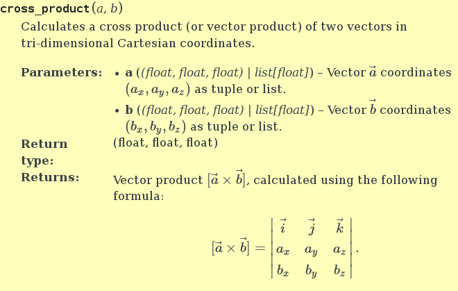
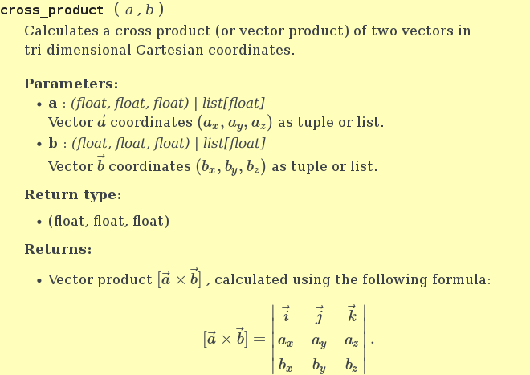

Parameters list as `
`'s in HTML generated by Sphinx
========================================================

This document is devoted to simple Sphinx extension named `divparams`, which
was created to bring another style to the lists of function parameters and
return values, generated by Sphinx.

To make use of the dirty hack this extension provides, first, install its
package from PyPI:

.. code-block:: bash

    $ sudo pip install sphinxcontrib.divparams

and then import it into your Sphinx's `conf.py` and add its parameters to the
lists of extensions, templates directories, and static directories:

.. code-block:: python

    import sphinxcontrib.divparams as divparams
    extensions       = [..., 'sphinxcontrib.divparams']
    templates_path   = [..., divparams.get_templates_path()]
    html_static_path = [..., divparams.get_static_path()]

    divparams_enable_postprocessing = True

The problem to solve
--------------------

Before we can go further, it's essential to figure out what's wrong with
current parameter lists in Sphinx. Take a look at the screenshot below (it's
`alabaster` theme, with background highlighted in yellow for readability):

As you may note, the example has parameters described in details, with inline
and display formulas rendered with MathJax. But Sphinx spends a lot of precious
space for its "Parameters" and "Returns" headers, thus ruining whole text
appearance. Moreover, this look cannot be change via CSS as it uses `<table>`
tags in its HTML markup.

This extension converts the above picture into a completely different style,
as shown on the next figure:

It works by post-processing generated HTML and turning all parameter tables
into a sequence of `
` blocks, easily styleable with CSS.

Raison d'être
-------------

The above operation is the only thing this package can do. Moreover, the way it
does the thing cannot be regarded to be very stable and reliable. Unfortunately,
this parameter tables appearance is hard-coded in `docutils` package, so the
right™ way would imply me contacting `doctutils` team, convincing them that the
feature would be useful not only for me, and, finally, patching their code and,
additionally, making `Sphinx` support this new `docutils` feature.

I couldn't wait that much.

What actually happens
---------------------

This extension does the following things behind the scenes:

  - registers a post-build handler,
  - gets the list of all HTML files generated,
  - finds `<table class="docutils field-list">` tags in each HTML file, and
    performs a DOM transformation.

This transformation is performed on a completely parsed HTML DOM, effectively
doing the following conversion (left side to right):

.. code-block:: html

    <table class="docutils field-list"> │ 

      <colgroup>...</colgroup>          │   

      <tbody>                           │     NAME
        <tr>                            │   

          <th class="field-name">       │   

            NAME                        │     BODY
          </th>                         │   

          <td class="field-body">       │   ... repeat divs
            BODY                        │ 

          </td>                         │
        </tr>                           │
        ... repeat rows                 │
      </tbody>                          │
    </table>                            │

The `BODY` fragment is additionally transformed to remove extra parentheses
around parameter type:

.. code-block:: html

    <ul>                                │ <ul>
      <li>                              │   <li>
        <strong>PARAM</strong>          │     <strong>param</strong>:
        (<em>TYPE</em>) – DESCR ...     │     <em>TYPE</em> 
      </li>                             │     DESCR ...
    </ul>                               │   </li>
                                        │ </ul>

Configuration and customization
-------------------------------

The extension currently respects two configuration parameters, which can be
given in `conf.py` file:

  `divparams_enable_postprocessing`:
    Enables or disables the whole post-processing thing. Don't forget to set
    this option to :const:`True` if you want this extension to do anything
    useful. Default value is :const:`False`.

  `divparams_exclude_sources`:
    List of sources which are not supposed to be post-processed. Use this option
    if you want old appearance for some of your documents. This list should
    contain relative file names without suffices. Default value is empty list.

You may also customize new list appearance by overriding `divparams.css`
stylesheet in your project. By default it only turns bold font for
`divparams-name` class. Below is the complete list of CSS class, added by the
extension:

  - `divparams-list`
  - `divparams-name`
  - `divparams-body`
  - `divparams-single-par`

Contact information
-------------------

This project author is me, Pavel Kretov. It's kept in a Git repository on
GitHub, so feel free to open an issue on its bug-tracker if you found a bug.

 Repository:
   https://github.com/firegurafiku/contribsphinx-divparams
 PyPI page:
   https://pypi.python.org/pypi/sphinxcontrib.divparams
 Travis-CI:
   https://travis-ci.org/firegurafiku/sphinxcontrib-divparams
 Original SO question:
   http://stackoverflow.com/questions/33296824

This work is provided under the term of MIT license.
